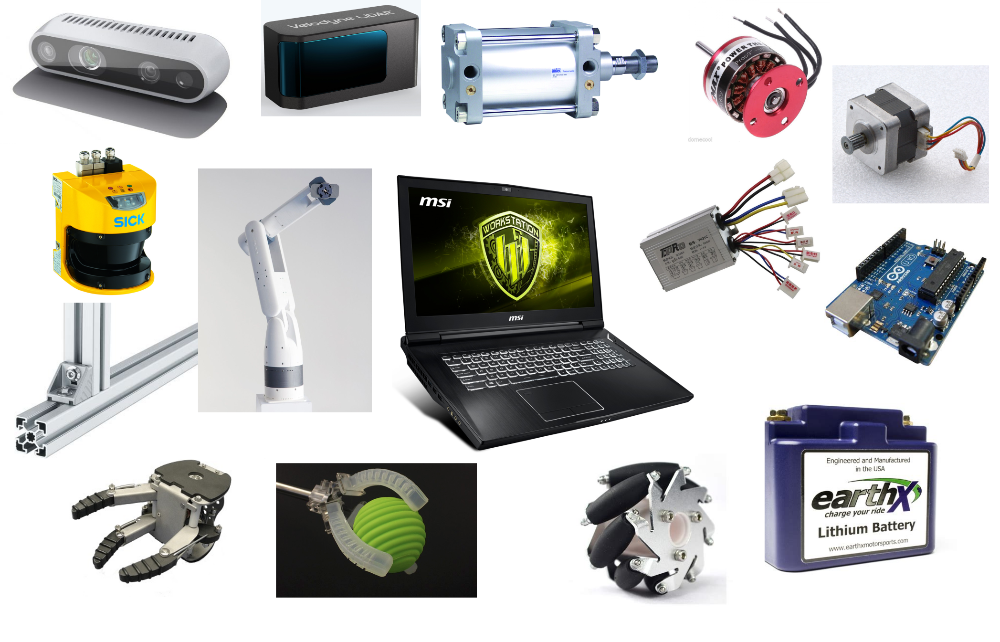

# LARM - Logiciel et Architecture pour la Robotique Mobile

### Software and Architecture for Mobile Robots

An Introduction  
 
Guillaume Lozenguez

## What is a Robot ?

## What is a Robot ?

### On wikipedia:

**en**

"A robot is a machine—especially one programmable by a computer— capable of carrying out a complex series of actions automatically."

**fr**

"Un robot est un dispositif mécatronique (alliant mécanique, électronique et informatique) conçu pour accomplir automatiquement des tâches imitant ou reproduisant, dans un domaine précis, des actions humaines."

## What is a Robot ?

### From my point of view

"A **robot** is a **mechatronics** machine capable of autonomously acting in a real environment"

- percives with *sensors*
- models its environnement and adapt its behavior
- acts with *actuators*

generally involves Artificail-Intelligence:

- capable to mimic natural (human, annimal, insect,...) intelligence

## Some examples

Macro: a large variety of robots

## Some examples

Micro: a large variety of components.

## From a mechanic point of view

### Focus on:

- Resistance
- Weight
- Deformation
- Vibration absortion
- Machining, Assembly

### for Different robots:

- Fast
- Precise
- Strong
- resistant (dust, water,...)
- safe
- less expensive

*From a electronic point of view*

Focus on sensor, motor, energy system and hardware.

## From a automation point of view

### Focus on:

- Phisics science
- Signal processing
- Control system

### by manipulating

- Times series, torques
- Vector, Matrices

## From a software point of view

### Focus on:

- Algorythms
- Knoledge reprensentation
- Artificial intelligence
- Software architecture

Robot are complex and singular systems  
which require modular computer program.

## Schedule

 
 
 

 - Introduction
 - Presentation of the UV
 - Today: First contact with **Linux** and **ROS**

## UV-LARM

 

   *Software and Architecture for Mobile Robots*

 

**Mostly about:** autonomous navigation.

- Communicate with robot components
- Controle robot movements (nonholonomic robot)
- Percive the local environnement (laser, vision)
- SLAM (Simultaneous Localisation and Mapping)
- Path finding and navigation.

## UV-LARM - Schedule

*1st week:* Introduction to notions with tutorials.

*2d week:* Chalenge kickoff and some complementary notions.

*3d week:* Chalenge as your projet.

*4th week:* Evaluation trough the code you provide.

## Why ROS:

**ROS:** The Robot Operating System (ROS) is a set of *software libraries* and *tools* that help you build robot applications.

- The number one Robotic Middle used in academic
- Open and oriented toward its *many contributors*
- Supported by most of the professionnals

It permits to think robot program in a modular way as independant program *nodes* working together by communicating trough *topics*.

It comes with usefull functionnality like *frame* management and *transform*

## Why Ubuntu Linux:

**Because:**

- We love *GNU*
- ROS nativelly support Ubuntu
- Linux is open and well documented

## Today:

### [wiki ROS](http://wiki.ros.org/) Beginner tutorials:

- Create a ROS project (catkin)
- Implement communicating nodes (publisher and subscriber)

### But first : Installation and configuration of Ubuntu:

- Setup tutorial on gitbook: <https://ceri-num.gitbook.io/uv-larm/>

## Before to go :

### Reminder on Linux Terminal (or Shell)

- **ls**: list directories elements
- **cd**: change the directory
- **rm**: permanently remove a file
- **man**: open the manuel on a command
- **sudo**: act as the super-user
- **find**, **egrep**, **cat**, **top**, **ps**, **apropos**...

 
 
 
 
And tabulation is your best friend.
