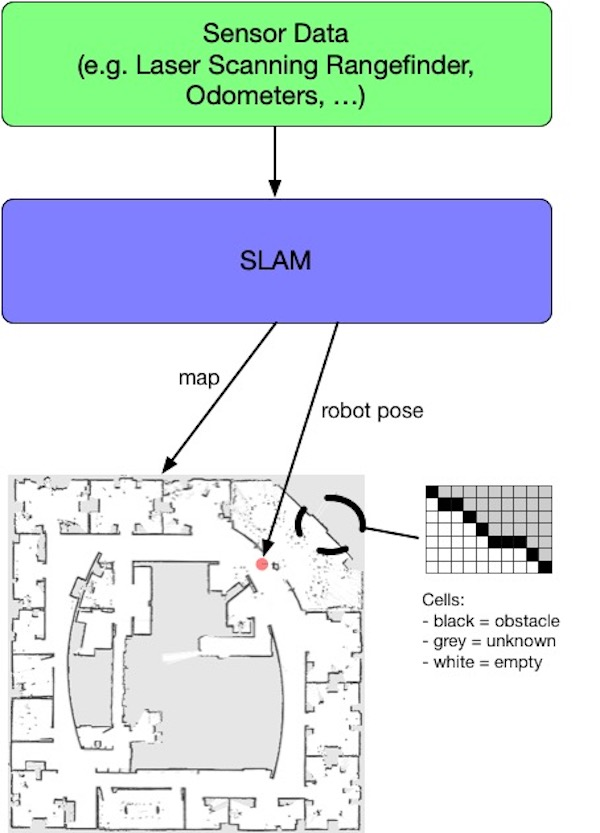
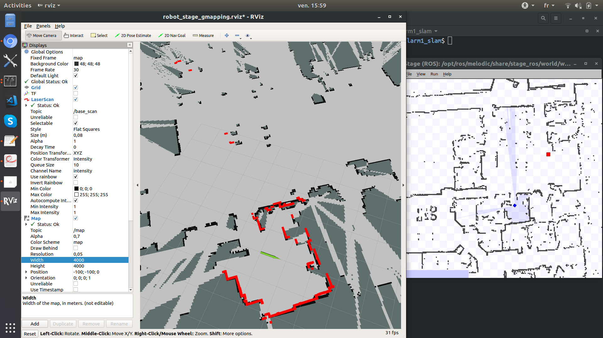
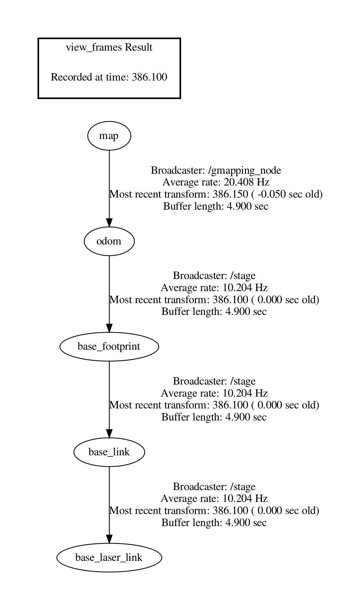

# What is SLAM in a Nutshell?

Mobile robots rely heavily on accurate representations of the environment (i.e *maps*) to fulfill their tasks (autonomous navigation, exploration, ...). Inside buildings, GPS signals are too weak to be used to localize robots. Hence we face a so-called Chicken-and-Egg-Problem, as *localization* requires a map, and map building (i.e. *mapping*) requires the current location.
One solution consists in doing *Simultaneous Localization and Mapping* (a.k.a. SLAM) using a SLAM algorithm that typically reaches centimetric precision. 

There are many different flavors of SLAM especially regarding the map format. The dominating 2D map format is the occupancy grid, also called grid map. A grid map is a matrix whose cells represents a defined region of the real world; this is the *resolution* of the grid map (typically a square of 5cm). A cell holds the estimated probability that the space it represents is traversable (free space) or not (obstacle). The simplest format is the 3-state occupancy grid in which a cell has 3 different possible values: 0 (free space), 0.5 (unknown) and 1 (obstacle).



<!-- 
Deeper explanation can be found in
 -->

<!-- Localization
- Dead Reckoning
- Particle Filters
- Kalman Filters
- Pose Graph Optimization
- Scan matching -->

# Goal of this Tutorial

- Discover and use ROS tools: `rqt_graph`, catkin, `rviz`, `rosbag`
- Use robotics simulators: **stage** (2d), **gazebo** (3d)
- Use *GMapping* (a ROS-based SLAM implementation) to build a map of an indoor environment both in simulation and in real world  
	
# Map building using GMapping

There are a lot of different SLAM algorithms and some implementations are open source and available on [openslam](https://openslam-org.github.io/).

We will use here the [GMapping](http://wiki.ros.org/gmapping) ROS implementation.

	```shell
	$ sudo apt install ros-melodic-openslam-gmapping ros-melodic-slam-gmapping
	```

To test it in simulation with stage, write a new launch file:


	```shell
	$ roslaunch larm1_slam robot_stage_gmapping.launch rviz:=true
	```

This launch file should launch:

- stage
- rviz
- teleop keyboard or joy
- gmapping

Now, if you teleoperate the robot in the simulated environment, you should see the result of GMapping (both the map and robot pose) updated in `rviz`.



There are a lot of things to take care to make `GMapping` work.
Try to think of the following questions:
- How GMapping get laser scans data?
- How GMapping correct robot position according to scan matching?

To solve problems, you must use ROS tools and analyse the result of `rqt_graph` as well as the [tf tree](http://wiki.ros.org/tf) (transformation frames) for example. 
Transformation frames (tf) is an important concept in ROS so read the tf documentation carrefully.
The correct ROS and tf graphs are shown below.
 


	```shell
	# command to export the tf tree
	$ rosrun tf view_frames
	...
	$ evince frames.pdf
	```



<!-- http://moorerobots.com/blog/post/3 -->

# Save and Replay Topic Data using `rosbag`

Working in simulation is nice but we can do better and work directly on real data using the `rosbag` command tool.
With the [rosbag command](http://wiki.ros.org/rosbag/Tutorials/Recording%20and%20playing%20back%20data), you can record some topics (all data that goes through) into a [bag file](http://wiki.ros.org/Bags) and play them later on. 
Bag files are really useful to test algorithms on real data sets that have been recorded in a specific location and with  specific sensors.
Moreover, there are a lot of public datasets available:

- http://radish.sourceforge.net/
- https://vision.in.tum.de/data/datasets/rgbd-dataset/download
- http://www.ipb.uni-bonn.de/datasets/
- http://car.imt-lille-douai.fr/polyslam/

First, follow the [GMapping tutorial using a rosbag](http://wiki.ros.org/slam_gmapping/Tutorials/MappingFromLoggedData).


Write and commit your own launch file named `gmapping_rosbag.launch` into the `larm1_slam` catkin package that launches a GMapping on a specific bagfile (I suggest the [DIA 1st floor](http://car.imt-lille-douai.fr/johann/turtlebot_dia.bag.gz)). This launch file should open an Rviz to see the map construction.


	```shell
	# launch GMapping on the DIA bag file
	$ roslaunch larm1_slam gmapping_rosbag.launch
	```

When the rosbag has finished to play, you can save the GMapping resulting map using the following command:

	```shell
	# save the GMapping map into a file
	$ rosrun map_server map_saver -f dia
	```

You will get a file named `dia.pgm` that is an image format representing the 3-state occupancy grid.

<!-- Comparing resulting maps and localization:
- cite Sang's paper
- Python package for the evaluation of odometry and SLAM
https://michaelgrupp.github.io/evo/ -->

# Bonus

This section is a bonus to discover other tools and techniques.

## Visual Map building using RTAB-Map 

You can also build 3d maps using an RGB-D camera such as the Realsense.
For this, you need to use another SLAM algorithm such as [RTAB-Map](http://wiki.ros.org/rtabmap_ros) with a [Realsense D435i](https://github.com/IntelRealSense/realsense-ros/wiki/SLAM-with-D435i).

As before, create different launch files:
- `realsenseTobag.launch` to save realsense data into a rosbag.
- `createMapfromRealsenseData.launch` to create and save the map using RTAB-Map from the bagfile
- `realsenseNavigation.launch` to load the saved map, localize and autonomously navigate on it

## Autonomous Vehicules

- 3d simulator dedicated to autonomous vehicules: https://www.lgsvlsimulator.com/
- https://www.autoware.org/
- Example of simulation with ROS and rosbags : https://gitlab.com/autowarefoundation/autoware.ai/autoware/wikis/ROSBAG-Demo


