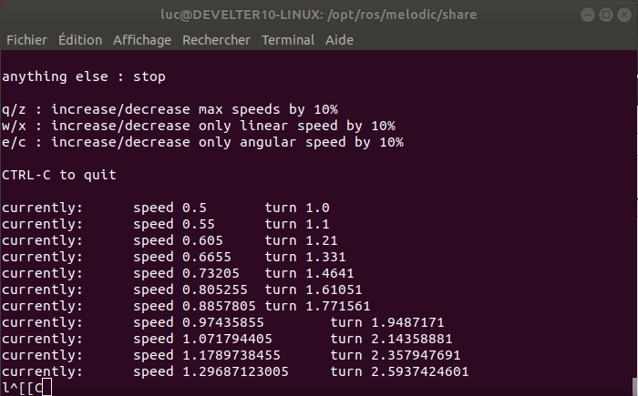
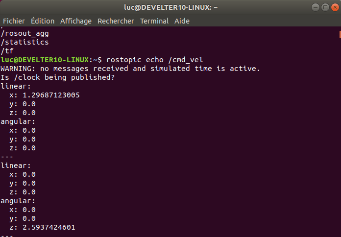
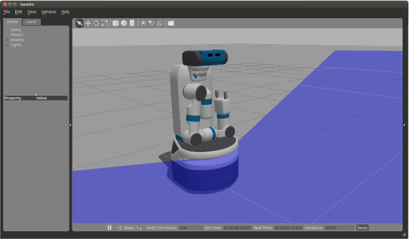

# What is SLAM in a Nutshell?

Mobile robots rely heavily on accurate representations of the environment (i.e *maps*) to fulfill their tasks (autonomous navigation, exploration, ...). Inside buildings, GPS signals are too weak to be used to localize robots. Hence we face a so-called Chicken-and-Egg-Problem, as *localization* requires a map, and map building (i.e. *mapping*) requires the current location.
One solution consists in doing *Simultaneous Localization and Mapping* (a.k.a. SLAM) using a SLAM algorithm that typically reaches centimetric precision. 

There are many different flavors of SLAM especially regarding the map format. The dominating 2D map format is the occupancy grid, also called grid map. A grid map is a matrix whose cells represents a defined region of the real world; this is the *resolution* of the grid map (typically a square of 5cm). A cell holds the estimated probability that the space it represents is traversable (free space) or not (obstacle). The simplest format is the 3-state occupancy grid in which a cell has 3 different possible values: 0 (free space), 0.5 (unknown) and 1 (obstacle).


<!-- 
Deeper explanation can be found in
 -->

<!-- Localization
- Dead Reckoning
- Particle Filters
- Kalman Filters
- Pose Graph Optimization
- Scan matching -->

# Goal of this Tutorial

- Discover and use ROS tools: `roscore`, `rosrun`, `roslaunch` (launch files), `rqt_graph`, catkin, `rviz`, `rosbag`
- Use robotics simulators: **stage** (2d), **gazebo** (3d)
- Use *GMapping* (a ROS-based SLAM implementation) to build a map of an indoor environment both in simulation and in real world  

# ROS Prerequisites

- ROS correctly installed (cf. [Setup](setup.md))
- A *catkin workspace* directory (usually `~/catkin_ws`) in which you will create your catkin packages or install third party ones

# 2d Simulation with Stage 

Let's start with a first 2d ROS simulation with the [stage](http://wiki.ros.org/stage) simulator.

>Stage provides several sensor and actuator models, including sonar or infrared rangers, scanning laser rangefinder, color-blob tracking, fiducial tracking, bumpers, grippers and mobile robot bases with odometric or global localization. 

##Install Stage

Check that stage is installed:

	```shell
	$ dpkg -l | grep stage
	ii  ros-melodic-stage        4.3.0-0bionic.20191008.154542    amd64    Mobile robot simulator http://rtv.github.com/Stage
	ii  ros-melodic-stage-ros    1.8.0-0bionic.20191008.204912    amd64    This package provides ROS specific hooks for stage 
	```

Install it otherwise:
	
	```shell
	$ sudo apt update
	$ sudo apt install ros-melodic-stage ros-melodic-stage-ros
	```

You can explore the files installed by these two packages:

	```shell
	$ roscd stage_ros
	```

##Stage Simulation with one Robot

[Source](http://wiki.ros.org/stage/Tutorials/SimulatingOneRobot)

	```shell
	$ roscore
	...
	# Launch stage in another shell
	$ rosrun stage_ros stageros $(rospack find stage_ros)/world/willow-erratic.world
	```


By pressing `r`, the stage simulation is rendered in 3d:
 


You can use various ROS tools to analyse what is involved in this simulation.

	```shell
	# show the ROS graph (nodes + topics)
	$ rqt_graph

	# list the ROS topics and available data
	$ rostopic list

	# read the willow-erratic.world file
	$ gedit $(rospack find stage_ros)/world/willow-erratic.world
	
	# launch a pre-configured rviz
	$ rviz -d $(rospack find stage_ros)/rviz/stage.rviz
	```

[rviz](http://wiki.ros.org/rviz) is a very useful and versatile tool to visualize data that goes through topics. 


##Controlling the Simulated Robot

Install needed packets if needed:

	```shell
	$ sudo apt install ros-melodic-teleop-twist-keyboard
	```

Launch a simple node to control a robot using keyboard:

	```shell
	$ rosrun teleop_twist_keyboard teleop_twist_keyboard.py
	```


Use `rqt_graph` to see the graph of ROS nodes and the topics they use to communicate.


Using `rostopic echo`, you see the data exchanged.



Try to issue a command (`rostopic pub`) that mimic `teleop_twist_keyboard` by publishing data directly into the topic `/cmd_vel`, it should make the robot move into stage.

Find how to control a robot with a joypad (xbox, ps3/4 controllers).

##Advanced Stage 

You can customize your simulation by writing your own `.world` file and for example:
- change the map
- change the robot model (sensors, body shape, ...)
- add multiple robots into the scene
- ...

You can find `world` file examples into the `stage_ros` and `stage` catkin packages as well as read the [documentation](https://player-stage-manual.readthedocs.io/en/stable/WORLDFILES/).

#Create and Version control your first catkin package


1. Connect to your account on [gvipers](https://gvipers.imt-lille-douai.fr/) (IMT Lille Douai gitlab)

2. Create a repository named `larm1_slam` 

3. Clone your git repository into `~/catkin_ws/src` 

	```shell
	$ cd ~/catkin_ws/src
	$ git clone https://gvipers.imt-lille-douai.fr/XXXX/larm1_slam
	``` 
4. Create two files in this catkin package:

	```shell
	# create an empty CMakeLists.txt
	$ touch CMakeLists.txt
	
	# mandatory metadata of this catkin package
	$ cat > package.xml <<END
		<package>
		  <name>larm1_slam</name>
		  <version>0.0.1</version>
		  <description>
		      SLAM experiements
		  </description>
		  <maintainer email="luc@luc.sw">Luc</maintainer>
		  <license>BSD</license>
		</package>
		END
	```
	
	Note that the `catkin_create_pkg` command tool can generate these two files, however it then requires to move files around to version them on git.

5. Commit / push 
	
	```shell
	$ cd ~/catkin_ws/src/larm1_slam
	$ git status # to view modified files
	$ git add -A # to add all files into the staging area
	$ git commit -m "my slam package"
	$ git push
	```

	You can now check on the web interface of your git repository to see these committed files.
	
	There are tons of ressources on the Web to learn more about git. 
	You can find your own or have a look at this one: [learngitbranching](https://learngitbranching.js.org/).

<!-- The floorplan map is given (*dia.pgm*). -->
<!-- The directory `~/catkin_ws/src/larm1_mapping` should contains: -->
<!-- - Create a *launch file* named (`imt.launch`) -->

#**Your** first launch file

Into your `larm1_slam` catkin package, create a *launch file* named `robot_stage.world` that launches a full-fledge simulation using stage with one robot equipped with 2d laser ranger.
The [launch file documentation](http://wiki.ros.org/roslaunch).
Once this file finished, you should be able to launch everything with this single command line:

	```shell
	roslaunch larm1_slam robot_stage.launch
	```

`rviz` might be launched also using an optionnal argument to the launch file.
 
	```shell
	roslaunch larm1_slam robot_stage.launch rviz:=true
	```

When a launch file uses a simulator instead of a real robot, it is mandatory that ensure that ROS uses the simulator clock instead of the real clock of your machine (cf. [ROS clock documentation](http://wiki.ros.org/Clock)).
To achieve this, add this line into your launch file:

	```xml
	 <param name="/use_sim_time" value="true">
	```

# Gazebo Simulator

[Gazebo](http://gazebosim.org/) simulator makes it possible to rapidly test algorithms, design robots, perform regression testing, and train AI system using realistic scenarios. Gazebo is integrated with ROS (cf. [Gezebo ROS](http://wiki.ros.org/gazebo_ros_pkgs)) and supports various robots out of the box.

Gazebo is heavily used by the DARPA challenges (cf. [Wikipedia](https://en.wikipedia.org/wiki/Gazebo_simulator)).
You can see videos online ([example](https://www.youtube.com/watch?v=v6-heLIg85o)) and even load the maps and robot model that are available.

Follow [this tutorial](http://docs.fetchrobotics.com/gazebo.html) to simulate the *freight robot* (available at IMT Lille Douai). 



	```shell
	$ roslaunch fetch_gazebo playground.launch robot:=freight
	
	$ roslaunch teleop_twist_joy teleop.launch joy_config:=xbox
	```

At IMT Lille Douai, we also have turtlebot robots that you can simulate in gazebo:


	```shell
	roslaunch turtlebot_gazebo turtlebot_world.launch
	```

Write and commit a new launch file into your `larm1_slam` package that launches everything:

	```shell
	roslaunch larm1_slam freight_gazebo.launch rviz:=true xbox:=true
	```

<!-- gazebo models
	cd ~/.gazebo/
	rm -fr models
	wget https://bitbucket.org/osrf/gazebo_models/get/e6d645674e8a.zip
	unzip osrf*.zip 
	rm *.zip
	mv osrf* models
	-->
	
# Map building using GMapping

There are a lot of different SLAM algorithms and some implementations are open source and available on [openslam](https://openslam-org.github.io/).

We will use here the [GMapping](http://wiki.ros.org/gmapping) ROS implementation.

	```shell
	$ sudo apt install ros-melodic-openslam-gmapping ros-melodic-slam-gmapping
	```

To test it in simulation with stage, write a new launch file:


	```shell
	$ roslaunch larm1_slam robot_stage_gmapping.launch rviz:=true
	```

This launch file should launch:

- stage
- rviz
- teleop keyboard or joy
- gmapping

Now, if you teleoperate the robot in the simulated environment, you should see the result of GMapping (both the map and robot pose) updated in `rviz`.


There are a lot of things to take care to make `GMapping` work.
Try to think of the following questions:
- How GMapping get laser scans data?
- How GMapping correct robot position according to scan matching?

To solve problems, you must use ROS tools and analyse the result of `rqt_graph` as well as the [tf tree](http://wiki.ros.org/tf) (transformation frames) for example. 
Transformation frames (tf) is an important concept in ROS so read the tf documentation carrefully.
The correct ROS and tf graphs are shown below.
 


	```shell
	# command to export the tf tree
	$ rosrun tf view_frames
	...
	$ evince frames.pdf
	```


<!-- http://moorerobots.com/blog/post/3 -->

# Save and Replay Topic Data using `rosbag`

Working in simulation is nice but we can do better and work directly on real data using the `rosbag` command tool.
With the [rosbag command](http://wiki.ros.org/rosbag/Tutorials/Recording%20and%20playing%20back%20data), you can record some topics (all data that goes through) into a [bag file](http://wiki.ros.org/Bags) and play them later on. 
Bag files are really useful to test algorithms on real data sets that have been recorded in specific location and specific sensors.  
Moreover, there are a lot of public datasets available:

- http://radish.sourceforge.net/
- https://vision.in.tum.de/data/datasets/rgbd-dataset/download
- http://www.ipb.uni-bonn.de/datasets/
- http://car.imt-lille-douai.fr/polyslam/

Follow the [GMapping tutorial using a rosbag](http://wiki.ros.org/slam_gmapping/Tutorials/MappingFromLoggedData).
Write and commit your own launch file named `gmapping_rosbag.launch` into the `larm1_slam` catkin package that launches a GMapping on a specific bagfile (I suggest the [DIA 1st floor](http://car.imt-lille-douai.fr/johann/turtlebot_dia.bag.gz)). This launch file should open an Rviz to see the map construction.

When the rosbag has finished to play, you can save the GMapping resulting map using the followin command:

	```shell
	# save the GMapping map into a file
	$ rosrun map_server map_saver -f myMap
	```
	
You will get a file named `myMap.pgm` that is an image format representing the 3-state occupancy grid.

<!-- Comparing resulting maps and localization:
- cite Sang's paper
- Python package for the evaluation of odometry and SLAM
https://michaelgrupp.github.io/evo/ -->

# Autonomous Navigation

Using the saved map, it is now possible to achieve autonomous navigation i.e. the robot can compute a global trajectory to a target point and then autonomously navigate to through this trajectory while avoiding obstacles locally. 

Write a new launch file named `navigation.launch` that achieve this.
Goals can be sent trhough rviz by clicking on a specific location on the loaded map.

Documentation and packages:
- http://wiki.ros.org/navigation/Tutorials
- http://wiki.ros.org/map_server
- http://wiki.ros.org/amcl
- http://wiki.ros.org/move_base

# [Bonus] Map building using RTAB-Map

You can also build 3d maps using an RGB-D camera such as the Realsense.
For this, you need to use another SLAM algorithm such as [RTAB-Map](http://wiki.ros.org/rtabmap_ros) with a [Realsense D435i](https://github.com/IntelRealSense/realsense-ros/wiki/SLAM-with-D435i).

As before, create different launch files:
- `realsenseTobag.launch` to save realsense data into a rosbag.
- `createMapfromRealsenseData.launch` to create and save the map using RTAB-Map from the bagfile
- `realsenseNavigation.launch` to load the saved map, localize and autonomously navigate on it

